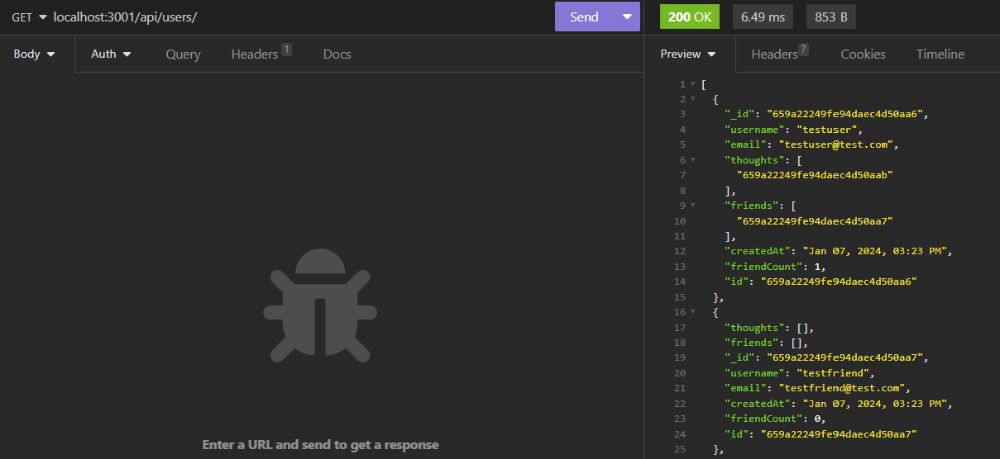
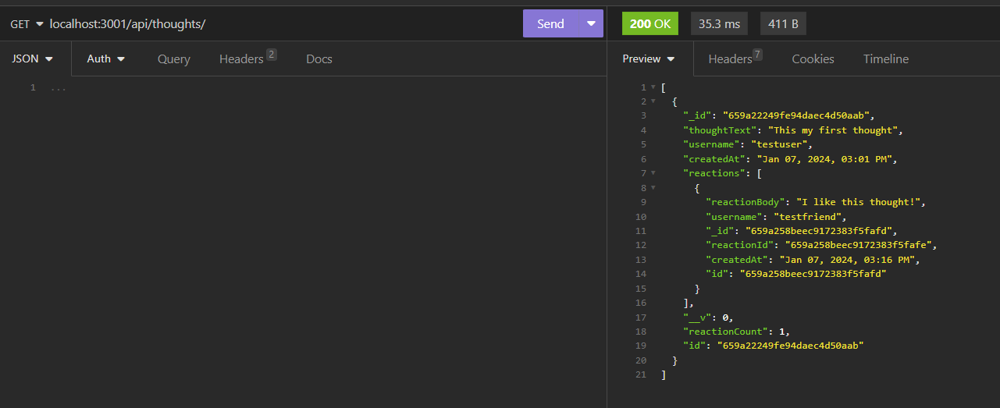

# Social-Network-API-NoSQL


## Description
    
A backend system for a social networking site built on MongoDB database. 
    
## Table of Contents
    
- [Installation](#installation)
- [Usage](#usage)
- [Credits](#credits)
- [License](#license)
- [How to Contribute](#how-to-contribute)
- [Tests](#tests)
    
## Installation
    
1. Fork this Git repo to your local directory.<br>
2. If you haven't already installed MongoDB Server, you may need to [download](https://www.mongodb.com/try/download/community/) the relevant version and install this on your local machine first.
3. Open the repo folder in VS Studio or your preferred code editor.<br>
4. Open the Integrated Terminal and enter command `npm install` to download the required Inquirer package.<br>
6. (Optional) Add sample data to your MongoDB by running command ```npm run seed```.


## Usage
    
Once the dependencies and database schema have been installed and setup, you can invoke the application with command `npm start` in the terminal. You can then send API requests to the database using tools such as Insomnia. Example of Get request sent to local host is `localhost:3001/api/users/`. For more detailed instructions, please watch the [walkthrough video]().<br>




    
## Credits
NA

## License
<br>
This project is licensed under the MIT License - see the [LICENSE.md](license) file for details    
 
## How to Contribute
    
Feel free to contribute your ideas or bug fixes for this project by raising a new issue or new pull request.
    
## Tests
    
NA